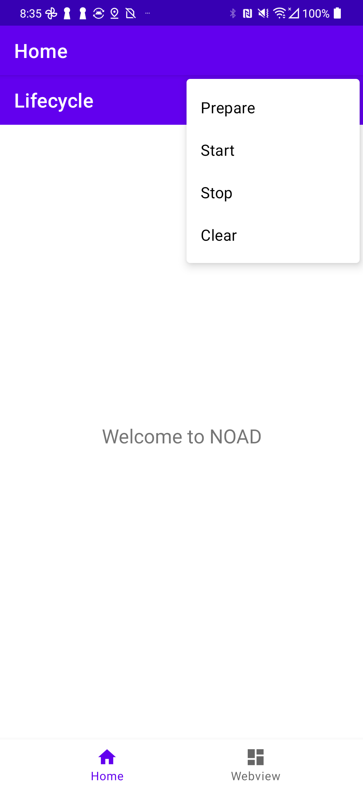
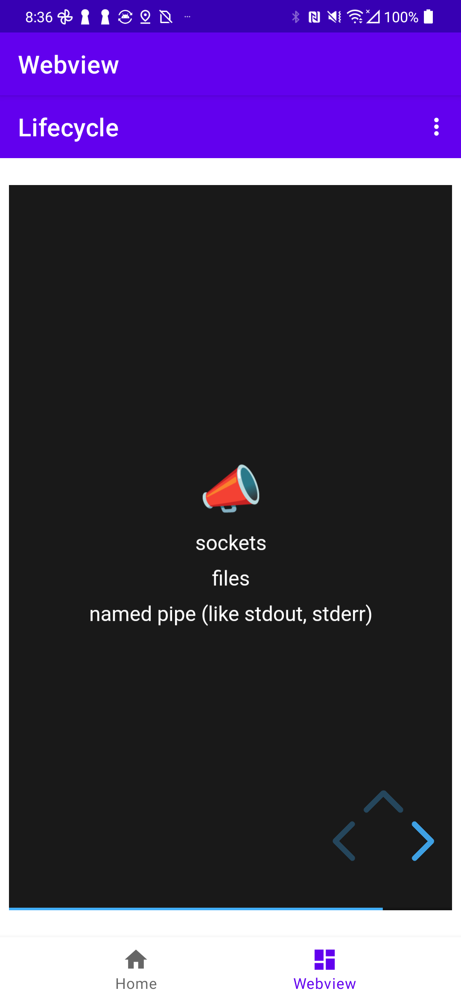

# NOAD - NodeJS on Android Demo

Demo the ability of running a NodeJS application within Android.

## Development

- Android Studio Flamingo
- NodeJS v18, npm
- Git LFS

### Checkout / Clone

- git lfs clone REPO

### Prepare NodeJS App

Just run the following:

```shell
./gradlew packageJs
```

Details:

- JS app resides in `app/demo-js`
- The JS app needs to be packaged into `assets/v1/demo-js.zip`
- gradle task `packageJs` is configured to do so (and does an `npm install` first)


## Demo

There's an HTML presentation about "NodeJS on Android" served by fastify running on NodeJS on port 3000 (see `app/demo-js/index.js`).

1. Run the app on Android
2. In the lifecycle navigation, open the menu on the right and ...
   1. Click on `prepare` to install the NodeJS App to the right place
   2. Click on `start` to start the NodeJS App (in Android)
2. The webview pane (bottom nav) opens `localhost:3000` and shows eventually the presentation (if the process got started)

The port is open to the world, means one can show the presentation in a browser of another device within the same network.

### App

The app itselfs doesn't do a lot. It supports proper ProcessControl (see presentation), but no lifecycle management!

| NOAD Main                           | NOAD Webview                        |
|-------------------------------------|-------------------------------------|
|  |  |


## Crafting the NodeJS binary

- use termux to build your own NodeJS executable. Ask https://github.com/neophob for help if needed.

## Limitations

- the `prepare` and `cleanup` steps are currently blocking the main thread (which is a very bad thing). Use background jobs for such things... 
- there's NO lifecycle control (see presentation) implemented.
- ATTENTION: don't use TCP/IP sockets for serving under Android in real world (except you know what you're doing). Use UNIX domain sockets instead.
